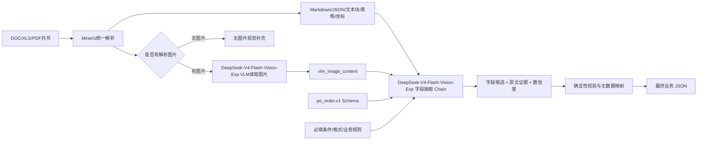

# AI 智能托书分析系统需求分析

## 1. 文档信息

| 项目 | 内容 |
| --- | --- |
| 文档名称 | AI 智能托书分析系统需求分析 |
| 文档版本 | v0.1 |
| 编写日期 | 2026-09-03 |
| 当前阶段 | 托书样例 MVP 需求与技术设计 |
| 目标项目 | `DocMind` |
| 目标业务系统 | `D:\poOrder` 订单层的订单新增 |
| 当前样例目录 | `D:\tengzhenhui\Desktop\托书样例` |

## 2. 背景与目标

### 2.1 背景

业务人员需要从客户提供的托书中读取订舱和货物信息，再手工填写到订单新增页面。当前样例以 `.doc`、`.xls` 和 `.pdf` 为主，版式包含中英文国际货运委托书、Shipping Order、Booking Information 和海空运输委托单，手工录入存在以下问题：

- 重复录入，处理效率低；
- 数字、日期、港口代码、运单号等关键字段容易录错；
- 同一字段在不同文件中的叫法不统一；
- 旧版 Word/Excel、PDF 和复杂表格无法用单一文本解析方式稳定读取；
- 业务字段存在条件必填关系，不能只依靠单字段识别；
- 缺少原文证据，出现错误时难以追溯和纠正。

### 2.2 建设目标

系统接收用户上传的托书，识别托书版式和内容，提取并标准化订单字段，最终输出可被订单系统消费的 JSON。

第一阶段只实现：

1. 支持当前托书样例中的 `.doc`、`.xls`、`.pdf` 文件上传；
2. 对托书中的文本、表格和页面图像进行解析；
3. 面向订单新增表单完成托书字段抽取；
4. 字段类型、格式、枚举和业务关系校验；
5. 输出业务 JSON，以及字段级证据、置信度和校验结果；
6. 对无法确认的字段返回空值和待人工确认原因，不允许模型猜测。

第一阶段不实现：

- 直接调用订单系统保存、分配或完成订单；
- 自动修改用户上传的原始文件；
- 复杂费用计算；
- 订单审批、信控和后续操作流程；
- 商业发票、装箱单、运单、报关单、进仓单等非托书单据的字段提取；
- 与当前样例差异过大的未知托书模板自动适配承诺；
- 以向量检索替代结构化字段抽取。

## 3. 需求范围

### 3.1 支持的输入文件

| 类型 | MVP 要求 | 处理方式 |
| --- | --- | --- |
| PDF | 必须 | 入口校验通过后进入 MinerU 单文件上传流程 |
| DOC | 必须 | 入口校验通过后进入 MinerU 单文件上传流程 |
| XLS | 必须 | 入口校验通过后进入 MinerU 单文件上传流程 |
| DOCX/XLSX | 暂不作为当前范围 | 第一阶段不承诺处理，后续如有托书样例再评估 |
| PNG/JPG/JPEG | 暂不支持直接上传 | 当前没有图片托书样例，页面图片只作为系统内部 VLM 输入 |
| 其它格式 | 暂不支持 | 返回 `FILE_TYPE_NOT_SUPPORTED` |

### 3.2 当前托书样例基线

当前开发和验收基线为 `D:\tengzhenhui\Desktop\托书样例` 下的 5 份文件：

| 样例文件 | 格式 | 托书版式 | 已观察到的主要内容 |
| --- | --- | --- | --- |
| `空运托书.doc` | DOC | 国际货运委托书 / Shipper's Letter of Instruction | 始发站、到达站、航班日期、发货人、收货人、通知人、贸易条款、进仓日期、件数、毛重、体积、尺寸、中英文品名 |
| `托书20260826 R3 TEC.xls` | XLS | 国际货运托运书 | 发货人、收货人、始发/到达机场、件数、毛重、体积、尺寸、中英文品名、HS Code、预付/到付 |
| `B-68046_托单.pdf` | PDF | 海空运输委托单 | 外运编号、装运港、目的港、船期/日期、运输方式、体积、运费条款、收汇方式、包装件数、毛重、净重、品名、HS Code、备注 |
| `Booking for GGK26-X049.xls` | XLS | Shipping Order | 发货人、收货人、通知人、运输服务、装运港、卸货港、最终目的地、订单号、HS Code、品名、数量、箱数、毛重、净重、体积、联系人 |
| `G2877FRA Booking information -- XPP to SKF Schweinfurt260814 XPP2608-09.doc` | DOC | Booking Information | 发货人、收货人、通知人、收货地点、包装数量、毛重、体积、包装种类、品名、HS Code、发票号、付款说明、唛头、计划进仓日期 |

范围约束：

- 当前仅识别上述样例及结构、字段语义相近的托书；
- 文件名不作为判断托书类型的唯一依据，必须结合正文标题和字段布局；
- 非托书文件返回 `DOCUMENT_TYPE_NOT_SUPPORTED`；
- 无法匹配已知版式但内容可判断为托书时，可以继续抽取，但整体状态不得直接标记为 `ready`；
- 新增托书模板必须先加入样例集和金标准数据，再纳入正式验收范围。

### 3.3 输出原则

- 输出 JSON，不输出面向业务用户的自由文本作为主结果；
- 字段 key 必须使用订单新增页面的业务 key；
- 未在原文中明确出现的字段，默认返回 `null`；
- 不能仅因为字段是必填就生成默认业务值；
- 每个非空字段必须能定位到原文证据；
- 每个字段都要有 `confidence` 和 `status`；
- 整体结果要经过 Pydantic schema 校验和业务规则校验后才标记为可提交；
- 对低置信度、冲突值、格式非法值和缺失值进行拦截。

## 4. 目标表单字段基线

### 4.1 字段来源

当前字段基线来自以下代码：

- `D:\poOrder\src\components\newOrderAdd.vue`
- `D:\poOrder\src\components\newOrderAddAi.vue`
- `D:\poOrder\src\common\fields.js`

订单新增页面通过 `newFormCmpt` 动态渲染字段，字段的 `required` 和 `hidden` 会随运输种类、服务方式、订单类型、订舱操作、服务项目等上下文变化。因此，AI 系统不能只维护一份静态“必填字段列表”，应维护：

1. 字段字典；
2. 场景条件；
3. 条件必填规则；
4. 字段标准化规则；
5. 字段证据和置信度要求。

### 4.2 当前代码中声明为 required 的字段

下表是从当前订单新增代码中的字段配置提取出的基线。`required: true` 表示页面配置声明必填，但是否生效仍需结合 `hidden`、订单场景和业务逻辑判断。

#### A. 基础信息层

| key | 页面名称 | 类型/格式 | 说明 |
| --- | --- | --- | --- |
| `area` | 委托唯凯站点 | 枚举/站点 | 当前页面基础信息必填 |
| `opersystemdom` | 服务方式 | 枚举：空运、海运、陆运、铁运、其它 | 当前页面基础信息必填 |
| `opersystem` | 运输种类 | 枚举：出口、进口、国内 | 当前页面基础信息必填 |
| `fid` | 委托客户 | 主数据 ID | 与 `gid` 联动 |
| `gid` | 项目 | 主数据 ID | 与客户、站点和运输种类存在业务关系 |
| `czlx` | 订舱操作 | 枚举：自货、代操作 | 当前页面基础信息必填 |
| `orderdom` | 订单类型 | 枚举：总单、直单、分单 | 由页面条件控制，部分场景隐藏 |
| `orderdomOut` | 外网订单类型 | 枚举：总单、直单 | 外网场景使用，部分场景隐藏 |
| `ordertype` | 订单形式 | 枚举：单票、批量 | 由订单类型和运输场景控制 |

#### B. 订舱/货物信息层

| key | 页面名称 | 类型/格式 | 说明 |
| --- | --- | --- | --- |
| `mawb` | 总运单号 | 字符串，需符合运单号规则 | 在 AI 进口页面中声明必填 |
| `hawb` | 分运单号 | 大写字符串 | 在总单/分单场景中按页面显示状态生效 |
| `ybpiece` | 预报件数 | 整数 | 预报货物件数 |
| `ybweight` | 预报重量 | 小数，最多两位 | 预报货物重量 |
| `ybvolume` | 预报体积 | 小数，最多三位 | 海运等场景使用 |
| `jfweight` | 计费重量 | 小数，最多两位 | AI 进口页面声明必填 |
| `sfg` | 始发港 | 港口代码/港口主数据 | 必须可映射到标准港口 |
| `mdg` | 到达港 | 港口代码/港口主数据 | 必须可映射到标准港口 |
| `hbrq` | 指定航班日期/到港日期 | `yyyy-MM-dd` | 页面文案随场景变化 |
| `hawb_ybpiece` | 分单件数 | 整数 | 总单包含分单时生效 |
| `hawb_ybweight` | 分单预报重量 | 小数，最多两位 | 总单包含分单时生效 |
| `hawb_jfweight` | 分单计费重量 | 小数，最多两位 | 总单包含分单时生效 |
| `hawb_sfg` | 分单始发港 | 港口代码/港口主数据 | 总单包含分单时生效 |
| `hawb_mdg` | 分单到达港 | 港口代码/港口主数据 | 总单包含分单时生效 |
| `hawb_englishpm` | 分单英文品名 | 大写字符串 | 分单信息页面声明必填 |
| `hawbList` | 进口分运单数组 | 数组 | 进口总单使用；进口直单不强制生成 |

#### C. 运输模式和费用层

| key | 页面名称 | 类型/格式 | 说明 |
| --- | --- | --- | --- |
| `fcllcllx` | 运输模式 | 枚举：整箱、拼箱 | 仅铁运场景显示并必填 |
| `fclcc` | 整箱尺寸 | 枚举：20、40 | 铁运且运输模式为整箱时必填 |
| `fclsl` | 整箱数量 | 整数 | 铁运且运输模式为整箱时必填 |
| `inwageallinprice` | 基港运价 | 数值 | 运价信息页面声明必填 |
| `isinwageallin` | 基港运价类型 | 枚举 | 费用信息页面声明必填 |
| `priceFp.self_real_bp_freight_in` | 唯凯实际分泡 | 数值 | `priceFp` 复合字段中的必填子字段 |
| `priceFp.cus_real_bp_freight_in` | 客户实际分泡 | 数值 | `priceFp` 复合字段中的必填子字段 |
| `first.self_real_bp_freight_in` | 基港唯凯实际分泡 | 数值 | `first` 复合字段中的必填子字段 |
| `first.cus_real_bp_freight_in` | 基港客户实际分泡 | 数值 | `first` 复合字段中的必填子字段 |

#### D. 提货/货物明细层

当启用提货/进仓相关服务时，以下字段需要作为一个完整对象校验，不能只抽到其中一部分：

| JSON 路径 | 页面名称 | 类型/格式 | 说明 |
| --- | --- | --- | --- |
| `ysservice.company_thr_org` | 提货单位 | 字符串 | 提货服务场景必填 |
| `ysservice.khjcno` | 客户进仓编号 | 字符串/多个值 | 多个编号用逗号分隔 |
| `ysservice.piece` | 件数 PCS | 整数 | 提货服务场景必填 |
| `ysservice.weight` | 重量 KG | 小数，最多两位 | 提货服务场景必填 |
| `ysservice.lxr_thr_org` | 联系人姓名 | 字符串 | 提货服务场景必填 |
| `ysservice.phone_thr_org` | 联系人电话 | 字符串 | 提货服务场景必填 |
| `ysservice.pickupdate_org` | 要求提货完成日期 | 日期时间 | 提货服务场景必填 |
| `ybstoreList[].khjcno` | 进仓编号 | 字符串 | `AB0420` 进仓服务场景必填 |
| `ybstoreList[].piece` | 货物件数 | 整数 | `AB0420` 进仓服务场景必填 |
| `ybstoreList[].weight` | 货物重量 | 小数，最多两位 | `AB0420` 进仓服务场景必填 |

### 4.3 不应误判为“必填”的字段

以下字段在当前代码中存在，但不能因为出现在 `inputModelData` 或页面表格中就自动视为必填：

- `hbh`、`qfsj`、`yqqcts`、`remark`、`hscode`；
- `englishpm`、`chinesepm`；
- `bglx`、`bgpiece`、`bgweight`；
- `company_thr_org` 之外的收货/送货扩展信息；
- `serviceList` 中未选中的服务；
- `goodsybpiece`、`goodsybweight`、`goodsybvolume` 等计算或展示字段；
- `zddlcode`、`zddlzh`、`zdiatacode` 等隐藏字段。

### 4.4 按运输种类生效的必填字段

`D:\poOrder\src\components\newOrderAdd.vue` 首先根据 `opersystem` 切换页面分支，再由 `opersystemdom` 处理空运、海运、陆运、铁运等服务方式。因此不能只根据 `opersystemdom` 判断必填字段。

| 运输种类 `opersystem` | 生效的主要必填字段 | 备注 |
| --- | --- | --- |
| 出口 | `sfg`、`mdg`、`ybpiece`、`ybweight`、`ybvolume`、`hbrq`、`hwlx` | 走出口订舱信息；正式订舱还需要完整 `ybstoreList` |
| 进口直单 | `mawb`、`ybpiece`、`ybweight`、`jfweight`、`sfg`、`mdg`、`hbrq` | 进口页面不使用出口的 `ybvolume`，增加总运单号和计费重量 |
| 进口总单 | 上述进口字段 + `hawbList` | 每个 `hawbList[]` 至少包含 `fid`、`gid`、`hawb`、`ybpiece`、`ybweight`、`jfweight`、`sfg`、`mdg` |
| 国内 | 不使用出口/进口订舱货物字段 | 走国内服务页面，要求客户、项目和服务项目 |

出口场景下再根据 `opersystemdom` 细分：

| 服务方式 `opersystemdom` | 额外必填字段 | 备注 |
| --- | --- | --- |
| 空运、海运、陆运 | 无 | 使用出口基础订舱字段 |
| 铁运 | `fcllcllx` | 页面名称为“运输模式”，`hbrq` 改为“发车日期” |
| 铁运整箱 | `fclcc`、`fclsl` | `fclcc` 为整箱尺寸，`fclsl` 为整箱数量 |
| 铁运拼箱 | 无 | `lclvolume` 会显示，但当前页面没有声明为必填 |

正式出口订舱还存在页面逻辑校验：`hwlx` 必须有值；`ybstoreList` 至少需要一条完整进仓明细；自货且非铁运时需要填写 `ybvolumeremark`；出口自货在部分站点还需要填写 `inwageallinprice`。其中 `isimperfect=2` 的预订舱场景不强制要求完整进仓明细。

### 4.5 国内服务的动态必填

选择 `opersystem=国内`，或者选择“其它”后页面将其转换为 `opersystem=国内服务`，此时不再走出口/进口的订舱货物字段校验。页面首先要求至少选择一个服务项目，然后按服务编码检查字段。例如：

| 服务编码 | 服务名称 | 主要必填字段 |
| --- | --- | --- |
| `AA0410`、`AG0145` | 始发港入仓 | `yjstorearea_org`、`yjstore_org`、`yjjcdate_org` |
| `AB0420` | 目的港入仓 | `yjstorearea_mdg`、`yjstore_mdg`、`yjjcdate_mdg` |
| `AA0510` | 始发港提货 | 要求提货时间、要求完成时间；部分操作地还要求提货费或卡车供应商 |
| `AB0520` | 目的港提货 | `pickupdate_mdg`、`yqfinishdate_mdg` |
| `AA0610`、`AG0150` | 报关/清关 | `bglx` |

其它服务（安检、交接、改包装、材料供应、挂衣、磁检、化检等）也有各自字段配置，最终应把 `service_codes` 和服务表单字段一起传入分析上下文。

### 4.6 MVP 建议的输入上下文

为了判断动态必填，调用方应尽可能提供以下上下文：

```json
{
  "opersystem": "出口",
  "opersystemdom": "空运",
  "area": "上海",
  "czlx": "自货",
  "orderdom": "总单",
  "orderdomOut": null,
  "ordertype": 1,
  "fcllcllx": null,
  "isimperfect": 1,
  "fid": null,
  "gid": null,
  "service_codes": ["AA0410"],
  "target_schema_version": "po_order.v1"
}
```

如果上下文不足，系统应输出 `context_incomplete`，而不是自行选择场景。

### 4.7 托书字段提取边界与映射

托书中不一定包含订单新增页面的全部必填项，因此字段来源分为两类：

#### A. 必须由调用方提供的订单上下文

以下字段通常不是托书正文中的稳定字段，不能由模型猜测，调用方应通过 `context` 传入：

| key | 说明 |
| --- | --- |
| `area` | 委托唯凯站点 |
| `opersystemdom` | 服务方式 |
| `opersystem` | 运输种类 |
| `fid` | 委托客户内部 ID |
| `gid` | 项目内部 ID |
| `czlx` | 订舱操作 |
| `orderdom` | 订单类型 |
| `orderdomOut` | 外网订单类型 |
| `ordertype` | 订单形式 |
| `service_codes` | 已选择的服务项目 |

如果调用方未提供上述字段，系统只抽取托书字段，整体结果不得标记为 `ready`，并在 `validation.errors` 中返回 `CONTEXT_INCOMPLETE`。

#### B. 主要从托书抽取的字段

| 订单 key | 托书常见标签/别名 | 抽取规则 |
| --- | --- | --- |
| `sfg` | 始发站、始发港、Airport of Departure、Port of Loading | 优先按标签和位置识别，最终映射为标准港口 |
| `mdg` | 到达站、目的港、Airport of Destination、Port of Discharge、Final Destination | 区分卸货港和最终目的地，不能无依据混用 |
| `hbh` | 航班号、Flight、Vessel/Flight | 只在明确出现运输班次编号时输出 |
| `hbrq` | 航班日期、船期、到港日期、计划进仓/港日期 | 必须保留原始标签，日期语义不明确时标记 `needs_review` |
| `ybpiece` | 件数、包装件数、No of Packages、Packages、托盘数量 | 优先取包装件数；`Quantity (PCS)` 与箱数同时存在时不能直接相加 |
| `ybweight` | 毛重、实际毛重、Gross Weight、G.W. | 统一为 KG，最多保留两位小数 |
| `ybvolume` | 总体积、体积、Volume、VOL、Meas. | 统一为 CBM，最多保留三位小数 |
| `englishpm` | 英文品名、Description、Nature and Quantity of Goods | 保留原文语义，按目标字段要求转大写 |
| `chinesepm` | 中文品名、中文货物品名 | 只抽取原文中文品名，不从英文翻译生成 |
| `hscode` | HS Code、海关代码、HS CODE | 只输出明确标注的编码，并校验数字格式 |
| `tradeterm` | 贸易条款、Trade Term、Incoterm | 例如 FCA、CIF；保留原文和标准化值 |
| `paymode` | 运费条款、Freight Prepaid/Collect、付款方式 | 只在标签明确表示运费支付方式时映射 |
| `orderno` | Booking No.、Order No.、S/O No.、外运编号 | 只映射明确的订单/订舱编号，不将发票号或 PO 号强行当作订单号 |
| `remark` | Remarks、Handling Information、备注、注意事项 | 保留原文，不擅自改写 |

以下托书字段在当前样例中较常见，但暂不作为订单必填字段主输出，默认保存在证据或扩展结果中，后续经业务确认后再决定是否回填：

- 发货人：`companytitle_fhr_mawb`、`address_fhr_mawb`、`lxr_fhr_mawb`、`phone_fhr_mawb`；
- 收货人：`companytitle_shr_mawb`、`address_shr_mawb`、`lxr_shr_mawb`、`phone_shr_mawb`；
- 通知人：`companytitle_tzr_mawb`、`address_tzr_mawb`、`lxr_tzr_mawb`、`phone_tzr_mawb`；
- 包装种类、尺寸、净重、数量 PCS、发票号、客户编号、唛头和收汇方式。

禁止以下错误映射：

- 不把 `B-68046`、`GGK26-X049` 等外部编号直接当作 `mawb`；
- 不把 `N.W.`/净重当作 `ybweight`；
- 不把 `Quantity (PCS)` 直接当作 `ybpiece`，除非托书没有包装件数且业务规则明确允许；
- 不把英文品名翻译成中文品名后作为 `chinesepm`；
- 不把托书中的收货人或发货人名称猜测为 `fid` 或 `gid` 内部 ID。

## 5. 功能需求

### 5.1 文件接收

- 当前接口每次只支持单文件上传和单文件分析；
- 入口节点首先执行非空校验和类型校验：文件大小必须大于 0，扩展名必须为 `.doc`、`.xls` 或 `.pdf`；
- 校验 MIME、文件扩展名和文件头，发现类型不一致时拒绝进入 MinerU；
- 生成 `document_id`、文件哈希和处理批次号；
- 原始上传文件保存到项目根目录 `data/uploaded_documents/`；
- MinerU 解析后的文档文件保存到项目根目录 `data/parsed_documents/`；
- 页面渲染图和视觉复核图片保存到 `data/rendered_pages/`；
- 最终 JSON、字段证据和校验结果保存到 `data/analysis_results/`；
- 任务状态、运行日志和错误信息保存到 `data/analysis_tasks/`；
- 支持幂等：相同文件哈希和相同 schema 版本可复用 `data/analysis_results/` 中已有结果；
- 不在日志中打印文件内容、身份证件、联系方式等敏感信息。

### 5.2 文件解析

- `.doc`、`.xls`、`.pdf` 统一直接交给 MinerU，不进行任何前置格式转换；
- 本地文件使用 MinerU 官网支持的上传地址接口 `POST /api/v4/file-urls/batch` 获取签名上传地址；
- 每次请求的 `files` 数组只包含一个托书文件，不做多文件批量解析；
- 使用 `PUT` 将本地文件上传到签名地址，上传请求不自行设置 `Content-Type`；
- 上传完成后通过 `GET /api/v4/extract-results/batch/{batch_id}` 轮询该单文件任务结果；
- `.doc`、`.xls`、`.pdf` 均保留为当前支持格式，`.xls` 是否可稳定解析以实际接口测试结果为准；
- MinerU 负责托书的文本、表格、版面、页面图片和 OCR 解析；
- MinerU 输出统一保存到 `data/parsed_documents/{task_id}/`，至少包括 Markdown、JSON、页面图片/坐标信息和解析日志；
- 解析器输出统一的 `DocumentBlock`，供后续流程使用。

### 5.3 模型上下文文件选择

MinerU 解析目录中的文件按以下优先级进入后续模型上下文：

| 文件 | 用途 | 是否直接进入模型上下文 |
| --- | --- | --- |
| `full.md` | 保留托书的主要文本、HTML 表格和阅读顺序 | 是，作为主文本上下文 |
| `*_content_list_v2.json` | 保留内容块类型、表格 HTML 和页码信息 | 是，作为 LangChain Chain 的独立输入 |
| `*_vlm_image_content.md` | VLM 读取 MinerU 输出图片后生成的视觉文本 | 仅在存在图片时作为第三个独立 Chain 输入 |
| `*_content_list.json` | 旧版内容块结构，作为兼容兜底 | 仅当 `content_list_v2.json` 不存在时使用 |
| `layout.json` | 低层版面、坐标和布局信息 | 否，仅用于证据定位和视觉复核 |
| `*_origin.xlsx` | XLS 解析产生的原始表格副本 | 否，第一阶段不直接读取作为模型文本；需要时用于人工复核 |
| `*_mineru_result.json` | MinerU 任务状态和结果地址 | 否，仅作为任务审计元数据 |
| `*_mineru_result.zip` | 原始解析压缩包 | 否，不直接发送模型 |
| `*_process.log` | 处理日志 | 否，防止日志噪声和敏感信息进入模型 |

系统不再生成 `model_context.md`。LangChain Chain 在调用 DeepSeek 时分别注入两个独立变量：

```text
full_markdown
structured_json
```

其中 `full_markdown` 来自 `full.md`，`structured_json` 来自 `*_content_list_v2.json`；当 v2 文件不存在时使用 `*_content_list.json`。如果解析目录存在图片，先由条件边进入 VLM 节点生成 `vlm_image_content`，再作为第三个独立输入传给字段抽取 Chain。两个 MinerU 文件可能包含重复内容，提示词会明确要求 DeepSeek 先去重和交叉核对，再输出结构化字段。模型不直接读取压缩包、日志或低层布局 JSON。

### 5.4 文档分类

当前只做托书识别和托书版式分型：

- 国际货运委托书 / Shipper's Letter of Instruction；
- 国际货运托运书；
- Shipping Order；
- Booking Information；
- 海空运输委托单；
- 其它托书模板；
- 非托书/未知文档。

非托书或无法确认是托书的文件不进入字段抽取，返回 `DOCUMENT_TYPE_NOT_SUPPORTED`。能够确认是托书但无法匹配已知版式的文件可以继续抽取，但整体状态默认为 `needs_review`。

### 5.5 字段抽取

抽取顺序：

1. 规则和正则识别；
2. 表格和键值对定位；
3. OCR 坐标和版式分析；
4. LLM 结构化抽取；
5. 多候选值合并；
6. 主数据映射；
7. 业务校验；
8. 置信度计算和结果分级。

LLM 只能从提供的文档片段中选择、归一化和解释字段，不能补写未出现的信息。

### 5.6 校验和结果分级

字段状态建议定义为：

| status | 含义 |
| --- | --- |
| `confirmed` | 已抽取、格式正确、证据充分、置信度达标 |
| `normalized` | 原文存在，已完成日期、单位、大小写或代码标准化 |
| `conflict` | 文档中出现多个互相冲突的候选值 |
| `missing` | 业务必填但原文未找到 |
| `invalid` | 找到内容但无法通过格式或业务校验 |
| `needs_review` | 有候选值，但置信度不足或依赖人工判断 |
| `not_applicable` | 当前订单场景不适用 |

整体状态建议定义为：

| overall_status | 条件 |
| --- | --- |
| `ready` | 所有当前生效必填项均为 `confirmed` 或 `normalized`，且无校验错误 |
| `needs_review` | 有低置信度、冲突、缺失或待确认字段 |
| `failed` | 文件不可解析、模型不可用或系统错误 |

## 6. 总体技术架构

### 6.1 逻辑架构

```text
客户端/订单系统
        |
        v
FastAPI API 层
        |
        +--> 文件校验与本地文件存储
        |
        +--> 任务服务
                 |
                 v
        LangGraph 分析工作流
          |       |        |
          |       |        +--> 业务规则与目标 Schema
          |       +-----------> 主数据映射
          +-------------------> 文本解析/OCR/表格解析
                 |
                 v
        结构化 JSON + 证据 + 置信度
                 |
        v
        data/ 本地文件目录
```

### 6.2 端到端处理链路图

以下链路是本系统 MVP 的标准处理路径。图中 `DeepSeek-V4-Flash-Vision-Exp` 同时承担两类模型任务：

- VLM 任务：结合页面图片，对 MinerU 解析出的文字、表格、坐标和版面进行视觉复核；
- LLM 任务：在目标字段 schema 和业务规则约束下，输出结构化字段候选、证据和解释。

```mermaid
flowchart TD
    A[用户/订单系统上传文件] --> B[FastAPI 接入层]
    B --> C{文件非空与类型校验}
    C -->|失败| C1[返回统一错误 JSON]
    C -->|通过| D[计算 SHA-256 并生成 task_id]
    D --> E[原文件写入 data/uploaded_documents]
    E --> F[写入 data/analysis_tasks/{task_id}/{task_id}_task_status.json]
    F --> G[任务队列/Worker]

    G --> H[LangGraph 初始化 State]
    H --> I[MinerU 申请单文件上传地址]
    I --> J[PUT 上传一份托书文件]
    J --> K[MinerU 自动解析]
    K --> L[轮询单文件结果接口]
    L --> L1[data/parsed_documents/{task_id}/]
    L1 --> M{解析目录是否产生图片}

    M -->|有图片| N[DeepSeek-V4-Flash-Vision-Exp VLM读取图片]
    M -->|无图片| O[跳过图片视觉节点]
    N --> P[保存 vlm_image_content.md]
    P --> Q[文档分类与字段候选定位]
    O --> Q

    Q --> R[加载 po_order.v1 目标字段 schema]
    R --> S[加载订单上下文和条件必填规则]
    S --> T[规则/正则/表格确定性抽取]
    T --> U[DeepSeek-V4-Flash-Vision-Exp 多模态结构化抽取]
    U --> V[输入 full.md、content_list_v2.json、vlm_image_content]
    V --> W[合并候选值与证据]
    W --> X[日期、单位、大小写、港口代码标准化]
    X --> Y[客户/项目/站点/港口主数据映射]
    Y --> Z[字段格式、枚举和业务一致性校验]
    Z --> AA{字段是否冲突或低置信度}

    AA -->|是| AB[保留候选并标记 needs_review/conflict]
    AA -->|否| AC[计算字段级与整体置信度]
    AB --> AC
    AC --> AD[生成业务 JSON、field_meta、validation]
    AD --> AE[写入 data/analysis_results/{task_id}/{task_id}_business_result.json]
    AE --> AF{整体是否可提交}
    AF -->|是| AG[overall_status=ready]
    AF -->|否| AH[overall_status=needs_review]
    AG --> AI[查询接口/回调返回 JSON]
    AH --> AI

    K -.解析异常.-> K1[MinerU 参数重试]
    K1 --> K
    U -.schema校验失败.-> U1[结构化重试一次]
    U1 --> U
    U1 -.仍失败.-> U2[返回 model_output_invalid]
    U2 --> AH
```

### 6.3 模型与解析器职责链



### 6.4 各环节输入输出

| 环节 | 输入 | 输出 | 是否允许生成业务值 |
| --- | --- | --- | --- |
| 文件校验 | 原始上传流 | 文件元数据、哈希、类型 | 否 |
| MinerU 上传 | 单份 DOC、XLS、PDF 托书 | `batch_id`、单个签名上传地址 | 否 |
| MinerU 解析 | 已上传的单份托书 | Markdown、JSON、文字块、表格、坐标、页面图片和 OCR 置信度 | 只保留原文识别结果 |
| VLM 图片读取 | MinerU 解析目录中的图片 | `vlm_image_content` 视觉文本 | 仅在有图片时执行，只能给出有视觉证据的辅助内容 |
| 确定性抽取 | 原文块、表格、字段规则 | 正则/表格候选 | 是，但必须可验证 |
| 多模态 LLM 抽取 | 两个 MinerU 文件、VLM 视觉文本、schema、上下文 | 结构化字段候选 | 只能从证据中抽取或标准化 |
| 主数据映射 | 候选值、主数据 | 标准名称、内部 ID、映射状态 | 不可猜测内部 ID |
| 业务校验 | 结构化结果、条件规则 | 错误、警告、状态 | 否 |
| 结果生成 | 校验后的候选 | 业务 JSON、字段元数据 | 只输出通过策略的值 |

### 6.5 推荐分层

```text
app/
  api/             FastAPI 路由，仅负责参数校验、鉴权和调用 Service
  service/         文件、任务、抽取、校验、结果业务逻辑
  workflow/        LangGraph 图定义、状态、节点和事件编排
    graph.py       只负责创建和连接工作流图
    state.py       工作流状态定义
    events.py      节点事件和发布协议
    nodes/         一个节点一个 Python 文件
  agent/           LLM 调用和字段抽取逻辑
  collector/       文件读取、OCR、解析器等外部采集能力
  schemas/         Pydantic 请求、响应和目标字段 schema
  prompts/         抽取、校验、冲突消解提示词
  config/          环境变量和配置
  storage/         本地文件目录、命名、读写和任务文件管理
  utils/           哈希、日期、单位、日志等通用工具
data/
  uploaded_documents/  原始上传文件
  parsed_documents/   MinerU 解析后的文档文件
  rendered_pages/     页面渲染图和视觉复核图片
  analysis_results/   最终 JSON、证据和校验结果
  analysis_tasks/     任务状态、运行日志和错误信息
tests/
docs/
```

工作流不直接访问 FastAPI 或文件系统；文件读写统一由 `storage`/Service 层提供。API 不直接拼接文件路径，也不直接编排 LangGraph 节点。

### 6.6 LangGraph 工作流

建议工作流节点：

```text
receive
  -> validate_file
  -> persist_uploaded_file
  -> parse_with_mineru
  -> route_image_step
  -> read_images_with_vlm（有图片时）
  -> persist_parsed_files
  -> classify_booking_document
  -> build_target_context
  -> extract_deterministic_candidates
  -> extract_llm_candidates
  -> normalize_candidates
  -> validate_candidates
  -> resolve_conflicts
  -> calculate_confidence
  -> persist_result_files
  -> complete
```

`parse_with_mineru` 节点内部严格按以下顺序执行：申请单文件上传地址、使用 `PUT` 上传一份本地文件、轮询该文件的解析结果、下载并保存解析压缩包。虽然官方上传地址接口路径包含 `batch`，但每次请求只传一个文件，不进行多文件批量解析。

每个节点都必须通过统一节点执行器记录开始、成功、失败、耗时和进度事件。事件先写入任务状态 JSON 和处理日志，后续可由同一个事件发布协议接入 SSE 或 WebSocket，不需要修改节点内部业务逻辑。

异常路径：

- 解析失败：使用 MinerU 参数重试；重试仍失败时标记 `PARSER_FAILED`；
- OCR 质量不足：标记 `needs_review`；
- LLM 输出不符合 schema：结构化重试一次，仍失败则 `failed`；
- 字段候选冲突：保留全部候选并进入冲突节点；
- 必填缺失：正常返回 JSON，但整体状态为 `needs_review`。

LangGraph 的 checkpoint 可用于长任务恢复、重试和人工确认；人工确认节点可使用 interrupt/resume 机制，但第一阶段只需返回待确认结果，不强制建设完整审核 UI。

## 7. 技术栈选型

| 层级 | 推荐技术 | 选型理由 |
| --- | --- | --- |
| 运行时 | Python 3.12 | 类型标注、异步生态和文档解析库成熟，项目统一使用 Python 3.12 |
| 环境与依赖管理 | uv | 统一管理 Python 版本、虚拟环境、项目依赖和锁文件 |
| API | FastAPI + Pydantic | 原生支持异步、文件上传、参数校验和 OpenAPI |
| 工作流 | LangGraph | 适合将确定性步骤、LLM 步骤、重试和人工确认编排在同一状态图中 |
| LLM 抽取 | LangChain | 统一模型调用、结构化输出、提示词和回调接口 |
| 文件存储 | 项目根目录 `data/` | MVP 阶段不使用数据库和对象存储，所有文件和结果落盘到项目本地目录 |
| 文档解析/OCR | MinerU | 统一直接解析 `.doc`、`.xls`、`.pdf` 托书，并输出 Markdown、JSON、文本块、表格、坐标和页面图片 |
| VLM/LLM | DeepSeek-V4-Flash-Vision-Exp | 同一个可识别图片的多模态模型，负责视觉复核和目标字段结构化抽取 |
| 任务执行 | FastAPI BackgroundTasks / 本地 Worker | MVP 不引入 Redis 等外部任务系统，使用后台任务或独立 Worker 处理耗时分析 |
| 观测 | structlog + OpenTelemetry + LangSmith（可选） | 请求链路、节点耗时、模型调用和错误追踪 |
| 测试 | pytest + pytest-asyncio | API、Service、Workflow 和字段规则测试 |
| 部署 | Docker Compose 起步，后续 Kubernetes | 本地开发简单，生产可扩展 |

### 7.1 选型约束

- 项目使用 `uv` 管理 Python 环境和依赖；
- Python 版本固定为 `3.12`；
- 所有运行依赖使用 `uv add` 安装；
- 所有开发、测试和代码质量依赖使用 `uv add --dev` 安装；
- 禁止在项目文档和开发流程中使用 `pip install`、手工维护 `requirements.txt` 作为依赖安装方式；
- `.doc`、`.xls`、`.pdf` 托书统一直接交给 MinerU，不引入其它前置解析链路；
- OCR 和版面解析统一使用 MinerU，不再引入 PaddleOCR 作为独立 OCR 主链路；
- VLM 和 LLM 统一使用 `deepseek-v4-flash-vision-exp`，通过图片输入和结构化输出完成视觉复核及字段抽取；
- 文件解析、文件读写、HTTP、模型调用统一使用异步接口或异步 Worker；
- API 只做请求校验、鉴权和 Service 调用；
- 所有本地文件读写通过 `storage` 层完成，禁止在 API、Workflow 和 Agent 中直接拼接路径或写文件；
- Prompt 文件统一放在 `app/prompts/`；
- 模型名、API Key、本地数据根目录和文件限制全部来自配置；
- 禁止把模型输出直接当作业务最终值，必须经过 schema 和规则校验。

### 7.2 uv 环境与依赖安装

项目初始化和依赖安装统一使用以下方式：

```bash
# 固定项目 Python 版本
uv python pin 3.12

# 创建虚拟环境
uv venv --python 3.12

# 安装运行依赖
uv add fastapi uvicorn pydantic python-multipart
uv add langchain langchain-openai langgraph
# MinerU 通过官网 HTTP API 调用，不安装本地 MinerU 解析包
uv add structlog opentelemetry-api opentelemetry-sdk

# 安装开发和测试依赖
uv add --dev pytest pytest-asyncio httpx
uv add --dev ruff mypy

# 根据 uv.lock 同步环境
uv sync

# 使用项目环境运行服务和测试
uv run uvicorn app.main:app --reload
uv run pytest
```

依赖管理要求：

- `pyproject.toml` 是项目依赖声明的唯一来源；
- `uv.lock` 必须纳入版本控制，保证开发、测试和部署环境一致；
- 新增包必须执行 `uv add 包名`，不得直接编辑锁文件；
- 删除包使用 `uv remove 包名`；
- 更新依赖使用 `uv lock --upgrade` 或针对单个包执行 `uv lock --upgrade-package 包名`；
- 生产启动使用 `uv run` 或在构建镜像时执行 `uv sync --frozen`；
- 若采用 MinerU 独立服务模式，应用侧保留 `httpx` 客户端，通过内部 MinerU API 获取解析结果，并将返回文件保存到 `data/parsed_documents/`；
- 若采用 DeepSeek 官方兼容接口，使用 `langchain-openai` 配置 `base_url` 和 API Key，不在代码中写死模型配置。

### 7.3 模型配置

模型配置统一通过环境变量或配置文件注入：

```env
DEEPSEEK_API_KEY=replace-me
DEEPSEEK_BASE_URL=https://api.deepseek.com
DEEPSEEK_MODEL=deepseek-v4-flash-vision-exp
DEEPSEEK_TEMPERATURE=0
DEEPSEEK_TIMEOUT_SECONDS=120
DEEPSEEK_MAX_RETRIES=1
DOCMIND_DATA_ROOT=data
```

命名说明：

- 业务称呼：`DeepSeek-v4flash-vision`；
- API 精确模型 ID：`deepseek-v4-flash-vision-exp`；
- 代码、配置、日志和结果中的 `model_name` 统一记录 API 精确模型 ID；
- 该模型同时用于 VLM 视觉复核和 LLM 结构化字段抽取；
- 由于模型输出仍可能存在识别错误，任何模型结果都必须经过证据绑定、Pydantic schema 校验、主数据映射和业务规则校验。

## 8. 本地文件存储设计

MVP 阶段暂不使用数据库和对象存储。所有上传文件、MinerU 解析文件、页面图片、中间结果、最终 JSON 和任务状态都保存在项目根目录 `data/` 下。

### 8.1 目录结构

```text
DocMind/
├── app/
├── data/
│   ├── uploaded_documents/   # 用户上传的原始文件
│   ├── parsed_documents/     # MinerU 输出的解析文件
│   ├── rendered_pages/       # 页面渲染图和 VLM 复核图片
│   ├── analysis_results/     # 最终 JSON、字段证据和校验结果
│   └── analysis_tasks/       # 任务状态、阶段进度和错误日志
├── docs/
└── pyproject.toml
```

目录命名要求：

- `uploaded_documents`：只保存用户原始上传文件，不保存解析覆盖版本；
- `parsed_documents`：只保存 MinerU 输出的解析文件；
- `rendered_pages`：保存供视觉模型识别的整页图和局部裁剪图；
- `analysis_results`：保存最终业务 JSON、字段元数据和校验结果；
- `analysis_tasks`：保存任务清单、状态快照、重试记录和脱敏日志；
- 所有目录由应用启动时自动创建，不依赖人工预先创建；
- `data/` 默认加入 `.gitignore`，防止业务文件和敏感数据进入版本库。

### 8.2 任务目录组织

为了避免不同任务之间文件混淆，建议每个任务使用独立目录：

```text
data/
├── uploaded_documents/
│   └── {task_id}/
│       ├── {document_id}_booking_request.pdf
│       └── {document_id}_booking_request.xls
├── parsed_documents/
│   └── {task_id}/
│       ├── {document_id}_mineru_content.md
│       ├── {document_id}_mineru_content.json
│       └── {document_id}_vlm_image_content.md
├── rendered_pages/
│   └── {task_id}/
│       ├── {document_id}_page_001.png
│       └── {document_id}_page_001_region_001.png
├── analysis_results/
│   └── {task_id}/
│       ├── {task_id}_business_result.json
│       ├── {task_id}_field_metadata.json
│       └── {task_id}_validation_result.json
└── analysis_tasks/
    └── {task_id}/
        ├── {task_id}_task_status.json
        ├── {task_id}_candidates.json
        └── {task_id}_process.log
```

### 8.3 文件命名规范

文件命名必须见名识意，并遵循以下规则：

```text
{业务标识}_{任务标识}_{文档标识}_{处理阶段}_{内容类型}.{扩展名}
```

实际命名建议：

| 文件类别 | 命名格式 | 示例 |
| --- | --- | --- |
| 原始上传文件 | `{document_id}_{原始文件名}` | `doc_001_booking_request.pdf` |
| MinerU Markdown | `{document_id}_mineru_content.md` | `doc_001_mineru_content.md` |
| MinerU JSON | `{document_id}_mineru_content.json` | `doc_001_mineru_content.json` |
| MinerU 表格 | `{document_id}_mineru_tables.json` | `doc_001_mineru_tables.json` |
| 页面图片 | `{document_id}_page_{页码}.png` | `doc_001_page_001.png` |
| 局部证据图 | `{document_id}_page_{页码}_region_{序号}.png` | `doc_001_page_001_region_001.png` |
| 业务结果 | `{task_id}_business_result.json` | `task_001_business_result.json` |
| 字段元数据 | `{task_id}_field_metadata.json` | `task_001_field_metadata.json` |
| 校验结果 | `{task_id}_validation_result.json` | `task_001_validation_result.json` |
| 任务状态 | `{task_id}_task_status.json` | `task_001_task_status.json` |
| 候选值 | `{task_id}_candidates.json` | `task_001_candidates.json` |
| 处理日志 | `{task_id}_process.log` | `task_001_process.log` |

命名规则：

- 文件名只允许字母、数字、下划线、短横线和原始扩展名；
- 原始文件名中的空格、路径分隔符和特殊字符必须清洗；
- 原始文件名过长时保留安全的文件名摘要，并在任务状态 JSON 中记录完整展示名；
- 页码和序号统一使用三位数字，保证目录排序稳定；
- 禁止使用 `1.json`、`result.json`、`new.pdf` 等无法表达业务含义的名称；
- 禁止使用用户原始文件名直接作为目录路径，防止路径穿越。

### 8.4 任务状态文件

`data/analysis_tasks/{task_id}/{task_id}_task_status.json` 作为 MVP 阶段的任务状态索引，示例：

```json
{
  "task_id": "task_20260903_000001",
  "request_id": "req_202609030001",
  "target_schema": "po_order",
  "schema_version": "po_order.v1",
  "status": "running",
  "progress": 55,
  "current_stage": "validate_fields",
  "source_documents": [
    {
      "document_id": "doc_001",
      "original_name": "booking_request.pdf",
      "uploaded_path": "data/uploaded_documents/task_20260903_000001/doc_001_booking_request.pdf",
      "parsed_path": "data/parsed_documents/task_20260903_000001/doc_001_mineru_content.json",
      "sha256": "..."
    }
  ],
  "attempt": 1,
  "created_at": "2026-09-03T12:00:00+08:00",
  "updated_at": "2026-09-03T12:01:30+08:00",
  "error": null
}
```

状态文件写入要求：

- 先写入同目录临时文件，再使用原子替换，避免接口读到半截 JSON；
- 状态枚举与接口响应保持一致；
- 每个阶段开始和结束时更新 `current_stage`、`progress` 和 `updated_at`；
- 任务重试递增 `attempt`，不覆盖历史结果；
- 处理日志只保存阶段、耗时、错误码和文件标识，不记录完整原文。

### 8.5 候选值和最终结果文件

一个字段可以有多个候选值，因此 `candidates.json` 必须保留所有候选和证据，不能只保存模型最后选择的值：

```json
{
  "task_id": "task_20260903_000001",
  "candidates": {
    "ybweight": [
      {
        "raw_value": "1,250.50 KGS",
        "normalized_value": 1250.5,
        "extract_method": "table",
        "confidence": 0.97,
        "source": {
          "document_id": "doc_001",
          "page_no": 1,
          "block_id": "page_001_table_002",
          "quote": "Gross Weight: 1,250.50 KGS"
        },
        "status": "normalized"
      }
    ]
  }
}
```

`analysis_results/` 下的结果文件必须与任务 ID 一一对应。结果写入完成后，才将任务状态改为 `succeeded` 或 `needs_review`。

### 8.6 本地文件保留与并发

- MVP 默认不提供跨机器共享文件能力，单实例部署时使用项目根目录 `data/`；
- 多 Worker 共享同一目录时必须使用唯一 `task_id` 和原子文件写入；
- 同一任务禁止多个 Worker 同时执行写入，使用任务锁或队列保证单任务串行；
- 定期清理任务由独立清理脚本或定时任务执行，不在请求线程中递归删除；
- 文件清理前必须校验解析后的绝对路径仍位于项目根目录 `data/` 内；
- 生产部署如需多实例、海量文件或跨节点处理，再评估数据库和对象存储迁移。

## 9. JSON Schema 与结果格式

### 9.1 业务结果 JSON

`result` 字段的 key 使用 `D:\poOrder` 订单新增页面的业务 key。第一阶段允许 `null`，是否缺失由 `field_meta` 和 `validation` 表达。

```json
{
  "schema_version": "po_order.v1",
  "result": {
    "area": null,
    "opersystemdom": null,
    "opersystem": null,
    "fid": null,
    "gid": null,
    "czlx": null,
    "orderdom": null,
    "orderdomOut": null,
    "ordertype": null,
    "mawb": null,
    "hawb": null,
    "ybpiece": null,
    "ybweight": null,
    "ybvolume": null,
    "jfweight": null,
    "sfg": null,
    "mdg": null,
    "hbrq": null,
    "hawb_ybpiece": null,
    "hawb_ybweight": null,
    "hawb_jfweight": null,
    "hawb_sfg": null,
    "hawb_mdg": null,
    "hawb_englishpm": null,
    "fcllcllx": null,
    "fclcc": null,
    "fclsl": null,
    "inwageallinprice": null,
    "isinwageallin": null,
    "ysservice": {
      "company_thr_org": null,
      "khjcno": null,
      "piece": null,
      "weight": null,
      "lxr_thr_org": null,
      "phone_thr_org": null,
      "pickupdate_org": null
    },
    "ybstoreList": []
  },
  "overall_status": "needs_review",
  "overall_confidence": 0.0,
  "field_meta": {},
  "validation": {
    "is_valid": false,
    "errors": [],
    "warnings": []
  }
}
```

### 9.2 字段元数据格式

```json
{
  "ybweight": {
    "value": 1250.5,
    "raw_value": "1,250.50 KGS",
    "status": "normalized",
    "confidence": 0.97,
    "evidence": [
      {
        "document_id": "8d4d...",
        "page_no": 1,
        "block_id": 12,
        "quote": "Gross Weight: 1,250.50 KGS"
      }
    ],
    "normalization": {
      "unit_from": "KGS",
      "unit_to": "KG",
      "rule": "remove_thousands_separator"
    },
    "validation_errors": []
  }
}
```

### 9.3 货物明细格式

```json
{
  "ybstoreList": [
    {
      "khjcno": "WH-001",
      "piece": 10,
      "weight": 125.5,
      "volume": null,
      "storeType": null,
      "yjstoredate": null,
      "packagetypename": null
    }
  ]
}
```

## 10. 接口字段设计

接口前缀建议为 `/api/v1`。

### 10.1 创建分析任务

`POST /api/v1/analysis/tasks`

请求方式：`multipart/form-data`

| 字段 | 类型 | 必填 | 说明 |
| --- | --- | --- | --- |
| `files` | `UploadFile[]` | 是 | 一个或多个文件 |
| `request_id` | string | 是 | 调用方幂等号 |
| `target_schema` | string | 是 | 固定为 `po_order` |
| `schema_version` | string | 是 | 例如 `po_order.v1` |
| `context` | JSON string | 否 | 订单场景上下文 |
| `callback_url` | string | 否 | 异步完成回调地址 |
| `options` | JSON string | 否 | OCR、是否强制重跑等选项 |

`context` 建议字段：

```json
{
  "opersystem": "出口",
  "opersystemdom": "空运",
  "area": "上海",
  "czlx": "自货",
  "orderdom": "总单",
  "orderdomOut": null,
  "ordertype": 1,
  "fid": null,
  "gid": null,
  "service_codes": ["AA0410"]
}
```

成功响应：`202 Accepted`

```json
{
  "request_id": "req_202609020001",
  "task_id": "7d9a8a6e-7dc4-4a61-9e07-7b2c2b1fd001",
  "status": "queued",
  "created_at": "2026-09-02T12:00:00+08:00"
}
```

### 10.2 查询分析任务

`GET /api/v1/analysis/tasks/{task_id}`

响应字段：

| 字段 | 类型 | 说明 |
| --- | --- | --- |
| `task_id` | string | 任务 ID |
| `status` | string | `queued/running/succeeded/needs_review/failed` |
| `progress` | integer | 0-100 |
| `current_stage` | string | 当前阶段 |
| `documents` | array | 文件解析状态 |
| `error` | object/null | 错误信息 |
| `created_at` | datetime | 创建时间 |
| `updated_at` | datetime | 更新时间 |

### 10.3 获取分析结果

`GET /api/v1/analysis/tasks/{task_id}/result`

响应为第 9 节定义的完整 JSON。

查询参数：

| 参数 | 类型 | 默认值 | 说明 |
| --- | --- | --- | --- |
| `include_evidence` | boolean | `true` | 是否返回证据 |
| `include_candidates` | boolean | `false` | 是否返回全部候选 |
| `include_raw_text` | boolean | `false` | 是否返回原文片段，生产默认关闭 |

### 10.4 重试分析

`POST /api/v1/analysis/tasks/{task_id}/retry`

请求字段：

```json
{
  "reason": "ocr_quality_low",
  "stages": ["ocr", "extract"],
  "force": false
}
```

### 10.5 人工确认/修正

`POST /api/v1/analysis/tasks/{task_id}/review`

请求字段：

```json
{
  "changes": [
    {
      "field_key": "ybweight",
      "value": 1250.5,
      "reason": "以托书上的盖章信息为准"
    }
  ],
  "submit": true
}
```

第一阶段可只保留接口，不建设独立审核页面。

### 10.6 目标字段配置

`GET /api/v1/schemas/po_order/{schema_version}`

用于向前端或调用方返回当前字段字典、场景条件、枚举、校验规则和版本号。

响应示例：

```json
{
  "schema": "po_order",
  "version": "po_order.v1",
  "fields": [
    {
      "key": "ybweight",
      "title": "预报重量",
      "type": "number",
      "precision": 2,
      "required_when": ["booking_active"],
      "evidence_required": true
    }
  ]
}
```

### 10.7 统一错误格式

```json
{
  "request_id": "req_202609020001",
  "code": "FILE_TYPE_NOT_SUPPORTED",
  "message": "当前文件类型不支持",
  "details": {
    "file_name": "example.zip",
    "supported_types": ["doc", "xls", "pdf"]
  }
}
```

建议错误码：

| 错误码 | 含义 |
| --- | --- |
| `INVALID_REQUEST` | 请求参数不合法 |
| `FILE_EMPTY` | 文件为空 |
| `FILE_TOO_LARGE` | 文件超限 |
| `FILE_TYPE_NOT_SUPPORTED` | 文件类型不支持 |
| `FILE_CONTENT_INVALID` | 文件内容损坏或签名不匹配 |
| `PARSER_FAILED` | 文档解析失败 |
| `OCR_FAILED` | OCR 失败 |
| `MODEL_OUTPUT_INVALID` | 模型输出无法通过 schema |
| `TASK_NOT_FOUND` | 任务不存在 |
| `CONTEXT_INCOMPLETE` | 动态字段判断所需上下文不足 |
| `INTERNAL_ERROR` | 未分类系统错误 |

## 11. 精准率设计

### 11.1 核心原则：宁可为空，不可猜错

对于订单录入场景，错误填入通常比字段为空更危险。因此采用“证据优先、规则优先、低置信度拒答”的策略：

1. 没有证据不输出业务值；
2. 证据冲突不自动选择；
3. 格式不合法不输出为 `confirmed`；
4. 主数据无法映射不输出内部 ID；
5. 必填字段缺失返回 `null`，并标记 `missing`；
6. 默认值只能来自目标系统明确的、可审计的业务规则，不能由 LLM 自行推断。

### 11.2 字段抽取策略

| 字段类型 | 首选方法 | LLM 作用 |
| --- | --- | --- |
| 运单号/分运单号 | 正则 + 校验位/长度规则 | 从多个候选中按标签和上下文排序 |
| 件数、重量、体积 | 数字解析 + 单位换算 | 识别字段语义和对应表格列 |
| 日期 | 日期解析 + 时区规则 | 识别“航班日期/到港日期/货好日期”等语义 |
| 港口 | 港口代码正则 + 主数据映射 | 处理自然语言港口名和别名 |
| 客户/项目 | 上下文或主数据搜索 | 返回候选，不直接猜内部 ID |
| 服务项目 | 关键词/服务代码字典 | 从文档描述映射候选服务代码 |
| 费用 | 数值规则 + 币种/单位 | 只做字段归属和证据说明 |
| 备注/品名 | 版式定位 + LLM | 只抽取原文，不擅自改写业务含义 |

### 11.3 置信度计算

建议拆分为：

```text
field_confidence =
  0.30 * extraction_confidence
  + 0.25 * evidence_quality
  + 0.20 * normalization_confidence
  + 0.15 * business_validation_confidence
  + 0.10 * cross_document_consistency
```

建议阈值：

- `>= 0.95`：可标记 `confirmed`；
- `0.85 - 0.9499`：可标记 `normalized`，仍需保留证据；
- `0.60 - 0.8499`：标记 `needs_review`；
- `< 0.60`：不输出业务值，标记 `missing` 或 `needs_review`。

阈值必须通过真实样本集校准，不应直接视为最终验收标准。

### 11.4 多文档冲突

同一字段的证据优先级建议：

1. 业务指定的最终确认文件；
2. 盖章或签字文件；
3. 结构化表格；
4. 普通正文；
5. 文件名或邮件主题。

如果不同文件中的值无法按配置确定优先级，则保留 `candidates` 并返回 `conflict`。

### 11.5 业务一致性校验

必须实现的校验：

- `ybpiece > 0`、`ybweight >= 0`、`ybvolume >= 0`；
- `hawb_ybpiece <= ybpiece`，适用时校验分单总件数；
- 进口总单的 `hawbList[].ybpiece` 合计必须等于总单 `ybpiece`；
- 进口总单的 `hawbList[].ybweight`、`hawbList[].jfweight` 合计不能小于总单对应值，特殊客户规则除外；
- 进口总单存在 `hawbList[].ybstoreList` 时，货物明细件数和重量合计必须分别等于总单 `ybpiece`、`ybweight`；
- 货物明细件数合计不能超过对应预报件数；
- 重量、体积必须匹配单位和小数位；
- `hbrq` 需符合日期格式和业务允许范围；
- `sfg`、`mdg` 不能相同，除非业务规则允许；
- `opersystem`、`opersystemdom`、`czlx`、`orderdom` 组合必须合法；
- `service_codes` 与货物明细/提货字段之间必须满足条件规则；
- 港口、客户、项目和站点必须能够映射到目标系统主数据；
- 当前生效的 `required` 字段不能为空；
- 页面计算字段不得由模型直接覆盖，应该由规则或目标系统计算。

## 12. 安全与合规

- 上传接口必须鉴权并限制租户数据隔离；
- 文件按任务生成不可猜测的目录和文件名；
- 文件下载只能通过受控接口完成，不直接暴露本地绝对路径；
- 对文件名、日志、错误信息做路径穿越和敏感信息防护；
- 限制文件大小、页数、图片分辨率和单任务文件数量；
- 对 PDF、Office 和图片做恶意文件扫描；
- 原文和证据访问需要权限控制；
- LLM 请求前按配置脱敏，禁止把无关敏感字段发送给第三方模型；
- 任务状态 JSON 中保存模型、提示词、解析器和 schema 版本，支持结果复现；
- 生产环境关闭详细原文日志。

## 13. 测试与验收

### 13.1 测试数据集

建立托书专用的脱敏金标准数据集，至少覆盖当前目录中的 5 份样例：

- `.doc`、`.xls`、`.pdf` 三种当前支持格式；
- 国际货运委托书、国际货运托运书、Shipping Order、Booking Information、海空运输委托单；
- 中英文混合、正文式托书和表格式托书；
- 件数、包装件数、数量 PCS、毛重、净重、体积、尺寸等相近字段；
- 始发/到达机场、装运港/卸货港/最终目的地等港口语义差异；
- 航班日期、船期、计划进仓日期等日期语义差异；
- 贸易条款、运费预付/到付、收汇方式等支付相关字段；
- 正常值、缺失值、错误值、单位混合、字段冲突和未知托书版式。

每个样本保存：

- 原始文件；
- 目标 JSON；
- 字段级证据；
- 动态场景上下文；
- 是否允许为空；
- 人工修正记录。

### 13.2 指标

第一阶段建议同时考核：

- 字段准确率：输出非空字段中正确字段的比例；
- 字段召回率：金标准字段中被正确输出的比例；
- 必填字段准确率；
- 关键字段准确率：运单号、件数、重量、体积、港口、日期；
- 拒答准确率：不能确认时是否正确返回空值/待确认；
- 业务校验拦截率；
- 端到端成功率；
- 平均处理时长和 P95 处理时长。

准确率不能只看整体 JSON 完整率。对于关键字段，宁愿召回率暂时较低，也要优先保证输出值的准确率。

### 13.3 验收建议

验收前由业务方确定关键字段名单和真实样本数量。建议先以以下方式验收：

- 关键字段准确率作为一票否决指标；
- 必填字段不能出现无证据的非空值；
- 低置信度样本必须进入 `needs_review`；
- 每个最终非空字段都能回溯到文件、页码、内容块和原文短证据；
- 相同输入、相同 schema 版本和相同模型配置应可复现或能解释差异；
- API OpenAPI 文档、错误码和 JSON Schema 可被调用方直接使用。

## 14. MVP 实施拆分

### 14.1 第一阶段

1. 建立 `po_order.v1` 字段字典和场景规则；
2. 完成 `.doc`、`.xls`、`.pdf` 托书上传的非空和类型校验；
3. 完成三种输入格式统一通过 MinerU 单文件上传流程的解析；
4. 将 MinerU 解析结果保存到 `data/parsed_documents/`；
5. 完成托书版式识别、结构化 LLM 抽取和 Pydantic 校验；
6. 完成港口、件数、重量、体积、HS Code 和日期的 P0 精度规则；
7. 完成候选标准化、字段校验、冲突处理和整体置信度节点；
8. 完成任务查询和结果查询接口；
9. 完成字段级证据、状态和置信度输出；
10. 建立当前 5 份样例的金标准和离线评估集。

### 14.2 第二阶段

1. 增加更多托书模板和真实业务样例；
2. 接入客户、项目、港口、站点和服务项目主数据；
3. 增加 LangGraph checkpoint、断点恢复和人工确认；
4. 增加候选值排序和跨文档冲突处理；
5. 增加 LangSmith/OTel 评估和生产观测；
6. 根据人工修正记录优化规则和提示词。

### 14.3 第三阶段

1. 与订单系统建立受控的 JSON 预填充接口；
2. 支持用户确认后回填，不直接自动提交；
3. 对高置信度且规则完全通过的订单开放自动回填；
4. 建立 schema 版本兼容和字段配置后台。

## 15. 待确认事项

以下事项需要业务方在开发前确认：

1. `D:\poOrder` 实际部署环境中的订单新增字段是否与当前代码版本一致；
2. `fid`、`gid`、港口、站点和服务项目的主数据查询接口；
3. 不同托书模板之间的业务优先级；
4. `orderdom`、`orderdomOut` 和进口/出口场景的实际组合；
5. `inwageallinprice`、分泡比例等费用字段是否纳入第一阶段；
6. 订单系统接收 JSON 时需要保留哪些隐藏字段或计算字段；
7. 文件保留期限、租户隔离和第三方模型数据合规要求；
8. 真实样本、金标准 JSON 和关键字段验收阈值。

## 16. 参考实现约束

实现时遵循以下约束：

- API -> Service -> Storage/Collector；
- Workflow -> Service；
- Agent 只负责 AI 模型调用和抽取，不直接访问本地文件系统；
- Collector 负责文件读取、OCR 和解析；
- 所有文件读写通过 `app/storage/` 统一完成，路径必须基于配置的 `DOCMIND_DATA_ROOT` 解析；
- 当前 MVP 不引入数据库、对象存储、Redis 或其它外部持久化服务；
- 所有提示词存放在 `app/prompts/`；
- 所有配置来自环境变量或配置层；
- 所有 Service 和 Workflow 行为配套单元测试；
- 不把模型自由文本直接作为业务 JSON；
- 不覆盖原始上传文件和原始解析文件，人工修正以新的结果文件和修正记录追加。
